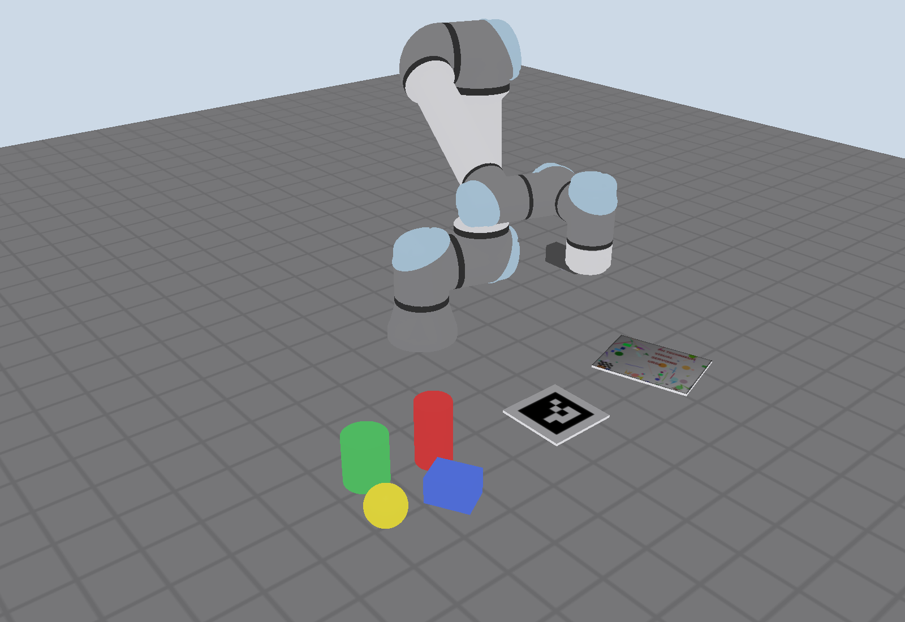
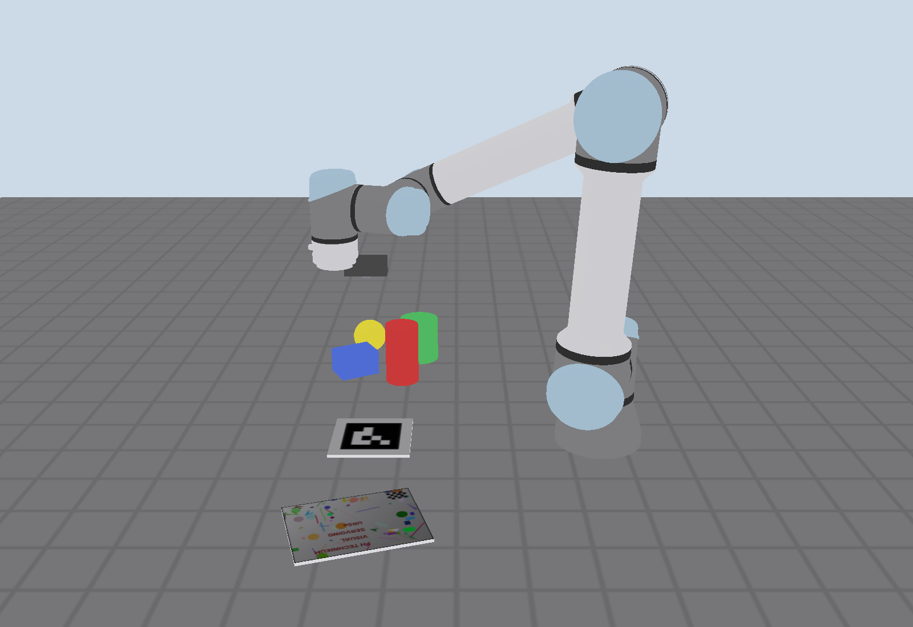
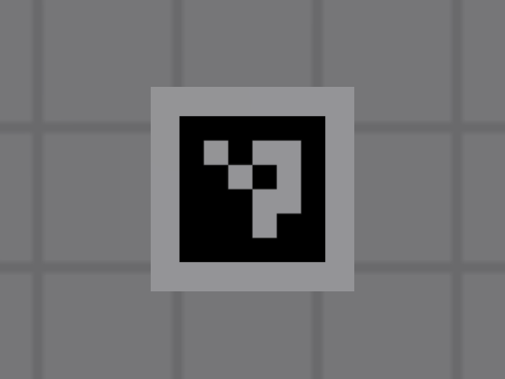
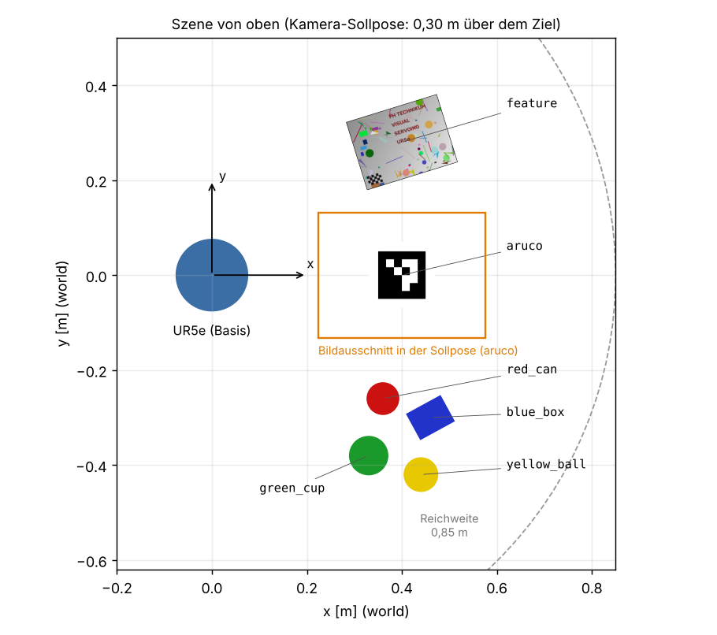

# Visual Servoing – UR5e-Simulation

Simulationsumgebung für das Projekt **Visual Servoing**: ein UR5e mit Handkamera (Eye-in-Hand) in Gazebo Harmonic, gesteuert über ROS 2 Jazzy. Alles läuft in einem Docker-Container, eine lokale ROS-Installation ist nicht nötig.



| Seitenansicht | Kamerabild in der Sollpose |
|---|---|
|  |  |

## Inhalt

| | |
|---|---|
| Roboter | UR5e (`ur_simulation_gz`), `ros2_control` mit Gelenkgeschwindigkeits-Schnittstelle |
| Kamera | 640 × 480 px, 30 Hz, horizontaler Öffnungswinkel 60°, am Flansch montiert |
| Ziele | ArUco-Marker, texturierte Tafel, vier Alltagsobjekte (Dose, Schachtel, Becher, Ball) |
| Werkzeuge | Startkonfigurationen anfahren, Referenzbild aufnehmen, Ground Truth für die Evaluierung |

---

## 1 Schnellstart

### Linux (X11)

```bash
git clone https://github.com/TW-Robotics/MVSR.git && cd MVSR/Lab/VisualServoing
docker compose build                 # einmalig, ca. 10 min
xhost +local:docker
docker compose run --rm sim          # NVIDIA-GPU: docker compose run --rm sim-nvidia
```

### macOS (Apple Silicon) – Funktionstest ohne GUI

Voraussetzung: [Colima](https://github.com/abiosoft/colima) oder Docker Desktop.

```bash
brew install colima docker docker-buildx        # falls noch nicht vorhanden
colima start --vm-type vz --cpu 4 --memory 8 --disk 60
docker context use colima
./run_headless_test.sh
```

Das Skript baut das Image (nativ arm64), startet die Simulation ohne GUI und schreibt Protokolle und Kamerabilder nach `data/test/` und `data/reference/`.

Hinweis: Colima und Docker Desktop geben standardmäßig nur das Home-Verzeichnis an Container frei. Liegt das Repository auf einem externen Laufwerk, funktionieren die Volume-Mounts der Compose-Dateien nur nach `colima start --mount "/Volumes/<Laufwerk>:w"`.

### Windows / macOS (Browser-GUI über noVNC)

```bash
docker compose -f docker-compose.novnc.yml build
docker compose -f docker-compose.novnc.yml up -d novnc
docker compose -f docker-compose.novnc.yml run --rm sim
```

Dann im Browser **http://localhost:8080/vnc.html** öffnen. Das Rendering läuft hier auf der CPU, die Simulation ist daher langsamer. Das noVNC-Image gibt es nur für amd64; auf Apple Silicon läuft es emuliert. Unter Windows funktioniert alternativ WSL2 mit WSLg und der Linux-Variante.

### Simulation starten (im Container)

```bash
ros2 launch vs_sim vs_sim.launch.py
```

Es öffnen sich Gazebo und ein Fenster mit dem Kamerabild. Für weitere Terminals im selben Container:

```bash
docker exec -it $(docker ps -qf ancestor=vs-sim:jazzy | head -1) bash
```

Launch-Argumente:

| Argument | Standard | Bedeutung |
|---|---|---|
| `target` | `aruco` | aktives Ziel für die Ground-Truth-Topics |
| `gazebo_gui` | `true` | `false` = ohne Gazebo-Fenster (Kamera wird trotzdem gerendert) |
| `image_view` | `true` | Kamerabild mit `rqt_image_view` anzeigen |
| `rviz` | `false` | RViz starten |
| `camera_rate` | `30` | Bildrate in Hz |
| `camera_noise` | `0.005` | Bildrauschen (Standardabweichung, 0–1) |

---

## 2 Schnittstellen

### Für die Regelung erlaubt

| Topic / Frame | Typ | Inhalt |
|---|---|---|
| `/camera/image_raw` | `sensor_msgs/Image` | Kamerabild (rgb8) |
| `/camera/camera_info` | `sensor_msgs/CameraInfo` | Intrinsik (K, D) |
| `/joint_states` | `sensor_msgs/JointState` | Gelenkpositionen und -geschwindigkeiten |
| TF `world → … → tool0 → camera_link → camera_optical_frame` | | Vorwärtskinematik inkl. Hand-Auge-Transformation |
| `/robot_description` | `std_msgs/String` | URDF (z. B. für eine eigene Jacobi-Matrix) |
| `/forward_velocity_controller/commands` | `std_msgs/Float64MultiArray` | **Stellgröße**: 6 Gelenkgeschwindigkeiten in rad/s |

Reihenfolge der Gelenkgeschwindigkeiten: `shoulder_pan, shoulder_lift, elbow, wrist_1, wrist_2, wrist_3`.

`camera_optical_frame` folgt der ROS-Konvention: z = Blickrichtung, x = rechts, y = unten.

### Nur für Evaluierung und Datenerzeugung (nicht in der Regelung!)

| Topic | Typ | Inhalt |
|---|---|---|
| `/ground_truth/target_pose` | `PoseStamped` | Zielkoordinatensystem (Oberseite des Objekts) in `world` |
| `/ground_truth/camera_pose` | `PoseStamped` | `camera_optical_frame` in `world` |
| `/ground_truth/desired_camera_pose` | `PoseStamped` | Sollpose der Kamera in `world` |
| `/ground_truth/camera_in_target` | `PoseStamped` | Kamerapose im Zielkoordinatensystem |
| `/ground_truth/pose_error` | `Float64MultiArray` | `[ex, ey, ez, rx, ry, rz, ‖e_t‖, ‖e_r‖]`: Fehler der Kamerapose gegenüber der Sollpose, im Soll-Kamerasystem (m, rad) |
| `/ground_truth/model_poses` | `tf2_msgs/TFMessage` | Posen aller Modelle aus Gazebo |

Das aktive Ziel wechseln: `ros2 topic pub --once /ground_truth/set_target std_msgs/String "data: red_can"` (macht `go_to_start` automatisch).

---

## 3 Werkzeuge

```bash
ros2 run vs_sim go_to_start --list                         # Ziele und Startkonfigurationen
ros2 run vs_sim go_to_start --target aruco --start 3       # Startkonfiguration 3 anfahren
ros2 run vs_sim go_to_start --target red_can --reference   # Sollpose anfahren
ros2 run vs_sim capture_reference --target aruco           # Referenzbild aufnehmen
ros2 run vs_sim capture_reference --all                    # ... für alle Ziele
ros2 run vs_sim example_joint_velocity                     # Minimalbeispiel für die Schnittstellen
```

**`go_to_start`** fährt die Kamera mit dem Trajektorien-Controller in die gewählte Pose und aktiviert danach den `forward_velocity_controller`. Der Roboter steht dann still und wartet auf Geschwindigkeitsbefehle. Die Gelenkkonfiguration ist für jede Kombination aus Ziel und Startkonfiguration immer dieselbe, die Durchläufe sind also reproduzierbar.

**`capture_reference`** speichert in `data/reference/`:
- `<ziel>.png`: Kamerabild in der Sollpose (= Referenzbild für Visual Servoing)
- `<ziel>.yaml`: Gelenkwinkel, Kameraintrinsik, Sollpose der Kamera im Zielsystem; beim ArUco-Ziel zusätzlich die vier Markerecken in Pixeln (= Soll-Bildmerkmale)

### Ziele



| Name | Objekt | Gedacht für |
|---|---|---|
| `aruco` | ArUco `DICT_4X4_50`, ID 0, 10 cm | KL (Marker), DL |
| `feature` | texturierte Tafel 20 × 15 cm | KL (Keypoints / Feature Matching), DL |
| `red_can`, `blue_box`, `green_cup`, `yellow_ball` | Objektgruppe | FM (z. B. „fahre über die rote Dose“), DL |

### Startkonfigurationen

Definiert in `vs_sim/config/targets.yaml` als Abweichung von der Sollpose (Verschiebung im Zielsystem, Drehung um die Achsen der Soll-Kamera). Aus allen Startkonfigurationen ist das Ziel vollständig im Bild. `S7_rotation_170` ist absichtlich schwer (170° um die optische Achse).

### Verwendung in einem Evaluierungsskript (Python)

```python
import rclpy
from vs_sim.motion import RobotMover

rclpy.init()
mover = RobotMover()
for start in range(1, 9):
    mover.go_to("aruco", start=start)   # danach ist der Geschwindigkeits-Controller aktiv
    # ... eigenen Regler starten, /ground_truth/pose_error aufzeichnen ...
```

---

## 4 Eigener Code

Eigene ROS-2-Pakete gehören nach `student_ws/src/` (im Container: `/ws/student/src`):

```bash
cd /ws/student && colcon build --symlink-install && source install/setup.bash
```

`student_ws/` und `data/` sind in den Container eingebunden, Änderungen bleiben also erhalten.

Zusätzliche Python-Pakete (z. B. PyTorch für DL/FM) mit `pip install --break-system-packages ...` installieren oder ein eigenes Dockerfile auf `vs-sim:jazzy` aufbauen. Achtung: `numpy>=2` nicht installieren, das bricht `cv_bridge`.

---

## 5 Fehlerbehebung

| Problem | Lösung |
|---|---|
| `cannot open display` | Auf dem Host `xhost +local:docker` ausführen |
| Gazebo sehr langsam | GPU-Variante verwenden (`sim-nvidia`) oder `gazebo_gui:=false` |
| Kein Kamerabild | `ros2 topic hz /camera/image_raw` prüfen; Gazebo braucht OpenGL ≥ 3.3 |
| ArUco-Marker wird nicht erkannt | `capture_reference --target aruco` meldet das. Erscheint der Marker gespiegelt: `python3 tools/generate_textures.py --mirror` im Ordner `vs_sim/` ausführen und das Image neu bauen |
| Topics aus anderen Containern sichtbar | Andere `ROS_DOMAIN_ID` setzen: `ROS_DOMAIN_ID=7 docker compose run --rm sim` |

---

## Für Lehrende

- **Offline-Prüfung** der Startkonfigurationen (Erreichbarkeit, Singularität, Sichtbarkeit): `ros2 run vs_sim check_start_configs`
- **Tests** (ohne Simulation): `cd /ws/src/vs_sim && python3 -m pytest test`
- **Funktionstest der ganzen Simulation** (headless, ohne GUI): `./run_headless_test.sh` auf dem Host
- **Neue Ziele / Startkonfigurationen**: Modell unter `vs_sim/models/`, Eintrag in `worlds/vs_world.sdf` und `config/targets.yaml`, danach `check_start_configs` und die Tests ausführen.
- **Image verteilen**: `docker build -t ghcr.io/<org>/vs-sim:jazzy . && docker push ghcr.io/<org>/vs-sim:jazzy`, in `docker-compose.yml` dann `image:` auf diesen Namen setzen. Die Studierenden brauchen dann nur `docker compose pull`.
- Die Ground-Truth-Topics sind für alle sichtbar. Dass sie nicht in der Regelung verwendet werden, wird über den Code im Abgabegespräch geprüft.
